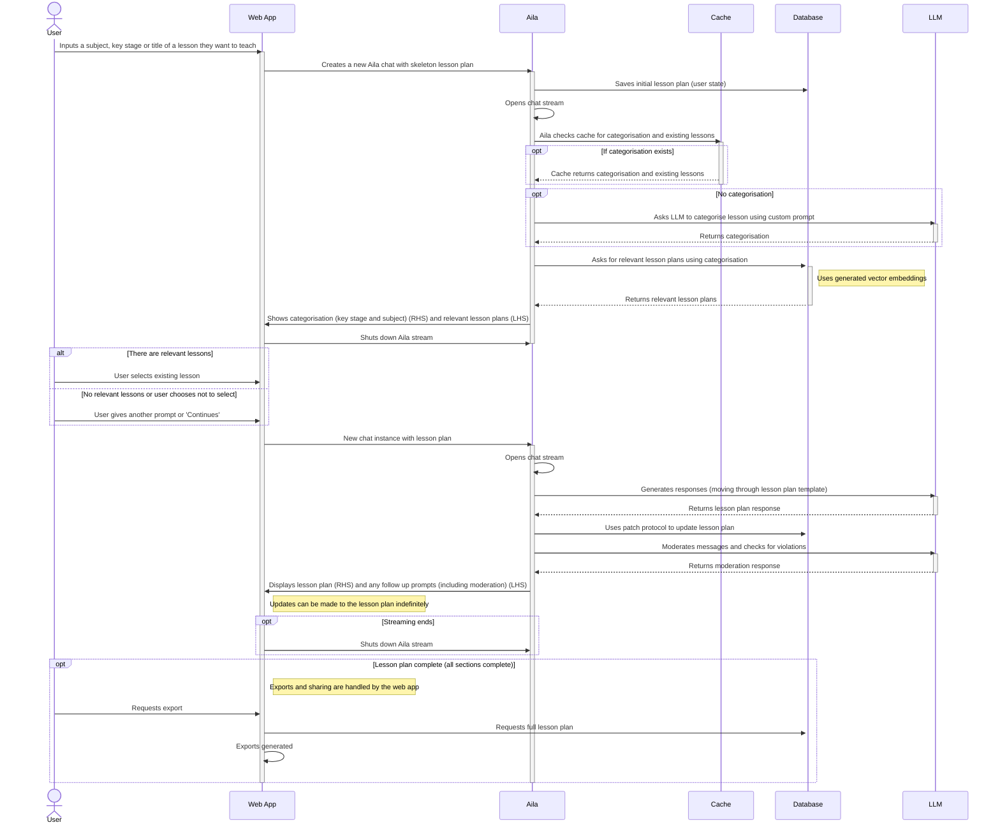

The following sequence diagram visualises a user completing Aila's lesson plan creation process.

```mermaid
	sequenceDiagram
		actor User
		participant Web App
		participant Aila
		participant Cache
		participant db as Database
		participant LLM

	User->>Web App: Inputs a subject, key stage or title of a lesson they want to teach
	activate Web App
	Web App->>Aila: Creates a new Aila chat with skeleton lesson plan
	activate Aila
	Aila->>db: Saves initial lesson plan (user state)
	Aila->>Aila: Opens chat stream
	activate db
	Aila->>Cache: Aila checks cache for categorisation and existing lessons
	activate Cache
	opt If categorisation exists
	Cache-->>Aila: Cache returns categorisation and existing lessons
	end
	deactivate Cache
	opt No categorisation
		Aila->>LLM: Asks LLM to categorise lesson using custom prompt
		activate LLM
		LLM-->>Aila: Returns categorisation
		deactivate LLM
	end
	Aila->>db: Asks for relevant lesson plans using categorisation
	activate db
	Note right of db: Uses generated vector embeddings
	db-->>Aila: Returns relevant lesson plans
	deactivate db
	Aila->>Web App: Shows categorisation (key stage and subject) (RHS) and relevant lesson plans (LHS)
	Web App->>Aila: Shuts down Aila stream
	deactivate Aila
	alt There are relevant lessons
		User->>Web App: User selects existing lesson
	else No relevant lessons or user chooses not to select
		User->>Web App: User gives another prompt or 'Continues'
	end
	Web App->>Aila: New chat instance with lesson plan
	activate Aila
	Aila->>Aila: Opens chat stream
	Aila->>LLM: Generates responses (moving through lesson plan template)
	activate LLM
	LLM-->>Aila: Returns lesson plan response
	deactivate LLM
	Aila->>db: Uses patch protocol to update lesson plan
	activate db
	Aila->>LLM: Moderates messages and checks for violations
	activate LLM
	LLM-->>Aila: Returns moderation response
	deactivate LLM
	Aila->>Web App: Displays lesson plan (RHS) and any follow up prompts (including moderation) (LHS)
	Note right of Web App: Updates can be made to the lesson plan indefinitely
	opt Streaming ends
	Web App->>Aila: Shuts down Aila stream
	end
	opt Lesson plan complete (all sections complete)
	Note right of Web App: Exports and sharing are handled by the web app
	User->>Web App: Requests export
	Web App->>db: Requests full lesson plan
	activate db
	Web App->>Web App: Exports generated
	end
	deactivate Aila
	deactivate Web App
```