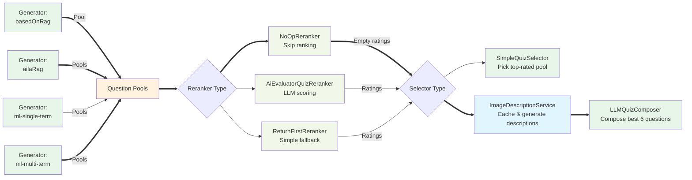

# Quiz Module

The quiz module generates, evaluates, and selects quiz questions for AI-generated lesson plans using a three-stage configurable pipeline architecture.

## Architecture Overview

The quiz generation system follows a three-stage pipeline where each stage is independently configurable:



### Pipeline Stages

**Stage 1: Generators** (run in parallel)
- Multiple generators retrieve candidates from different sources
- Each returns `QuizQuestionPool[]` with source metadata

**Stage 2: Reranker**
- Evaluates and scores question pools
- Options: NoOpReranker, AiEvaluatorQuizReranker, ReturnFirstReranker
- Returns `RatingResponse[]` (or empty for no-op)

**Stage 3: Selector**
- Selects final 6 questions from all pools
- Options:
  - **SimpleQuizSelector**: Picks from highest-rated pool (no image processing)
  - **LLMQuizComposer**: Processes images then intelligently composes quiz
    - Extract images from all candidate pools
    - Check Redis cache for existing descriptions
    - Generate descriptions for uncached images (vision LLM)
    - Replace markdown images with text descriptions
    - LLM composition to select best 6 questions

### 1. Generators (`generators/`)

Generate candidate question pools from various sources. **Multiple generators run in parallel**, each producing a pool of candidate questions:

- **AilaRagQuizGenerator** (`rag`): Questions from AILA RAG-retrieved lesson content
- **BasedOnRagQuizGenerator** (`basedOnRag`): Retrieves quiz from user-specified source lesson (high signal when available)
- **MLQuizGenerator** (`ml`): Single-term semantic search with Cohere reranking (older approach)
- **MLQuizGeneratorMultiTerm** (`ml-multi-term`): **NEW** - Multiple semantic searches based on multiple search terms with Cohere reranking (current recommended ML approach)

Each generator returns a `QuizQuestionPool[]` with source metadata (e.g., which lesson, which search term).

### 2. Rerankers (`rerankers/`)

Evaluate and rank the question pools from generators:

- **AiEvaluatorQuizReranker** (`ai-evaluator`): Uses AI to score each pool's quality (older approach)
- **ReturnFirstReranker** (`return-first`): Rates first pool=1, others=0 (simple fallback)
- **NoOpReranker** (`no-op`): Returns empty ratings array (used with LLM composer selector)

Returns a `RatingResponse[]` parallel to the question pools.

### 3. Selectors (`selectors/`)

Select final questions from the candidate pools using the rankings:

- **SimpleQuizSelector** (`simple`): Picks top-ranked questions from highest-rated pool
- **LLMQuizComposer** (`llm-quiz-composer`): **NEW** - Uses AI to intelligently mix the best questions from each generator pool, ignoring rankings and making holistic decisions

### Full Services (`fullservices/`)

Orchestrate the complete quiz generation pipeline:

- **BaseFullQuizService**: Concrete implementation that runs generators→reranker→selector pipeline
- **buildFullQuizService**: Factory function that builds a `FullQuizService` from configuration

## Key Interfaces

- **FullQuizService**: Main interface for complete quiz generation services
- **AilaQuizCandidateGenerator**: Interface for quiz generators that produce candidate pools
- **AilaQuizReranker**: Interface for quiz rerankers that score pools
- **QuizSelector**: Interface for quiz selectors that choose final questions
- **AilaQuizComposer**: Interface for composers that actively construct quizzes (newer approach)
- **QuizQuestionPool**: Structure containing questions + source metadata (lesson/search term)
- **QuizQuestionWithRawJson**: Core quiz question type with raw JSON data

## Usage Example

```typescript
import { buildFullQuizService } from "./fullservices/buildFullQuizService";

// Build a quiz service with the new recommended pipeline
const quizService = buildFullQuizService({
  quizGenerators: ["basedOnRag", "rag", "ml-multi-term"],
  quizReranker: "no-op",
  quizSelector: "llm-quiz-composer",
});

// Generate a quiz for a lesson plan
const quiz = await quizService.buildQuiz(
  "/starterQuiz",
  lessonPlan,
  relevantLessons,
);
```

### Current Recommended Pipeline

```typescript
{
  quizGenerators: ["basedOnRag", "rag", "ml-multi-term"],  // Mix all sources
  quizReranker: "no-op",                                   // Skip reranking
  quizSelector: "llm-quiz-composer"                        // Let AI pick best from each pool
}
```

This pipeline:
1. Generates candidates from user's source lesson (if specified), RAG lessons, and ML semantic search
2. Processes images: extracts URLs, checks cache, generates descriptions for uncached images
3. Skips the reranking step (no-op)
4. Uses AI to intelligently select the best questions from all pools, mixing results rather than picking a single best generator

## Services (`services/`)

Shared services used across the quiz generation system:

### ImageDescriptionService

Processes images in quiz questions by converting them to text descriptions before LLM composition.

**Capabilities:**
- Extract image URLs from question markdown (``)
- Batch cache lookups using Redis `mget` for efficiency
- Generate pedagogical descriptions using GPT-4o-mini vision model
- Rate limiting (10 concurrent vision API calls)
- Replace images with text: `` → `[IMAGE: description]`

**Caching:**
- **Key format**: `quiz:image-description:${url}`
- **Storage**: Redis/KV (90-day TTL)
- **Strategy**: Check cache first, generate only for misses, store results

**Description Quality:**
- ✓ Focus on mathematical content (numbers, variables, equations, shapes)
- ✓ Include directly labeled numbers
- ✗ Avoid measuring values from scales/grids (prevents hallucination)
- ✓ Keep to 1-2 sentences

Examples:
- ✓ "A right triangle with sides labeled 3cm, 4cm, and hypotenuse x"
- ✓ "A bar chart comparing categories walk, car, and bus"
- ✗ "A colorful diagram with shapes on white background"

**Testing:**
- `scripts/test-image-descriptions.ts` - Test description generation
- `scripts/generate-image-html.ts` - Visualize descriptions in browser
- `scripts/clear-image-cache.ts` - Manage cache

### OpenAIRanker

Evaluates quiz questions using OpenAI models with vision support for rating question quality and alignment with lesson objectives.

### CohereReranker

Reranks candidate questions using Cohere's cross-encoder model for improved relevance scoring.

### LessonSlugQuizLookup

Looks up quiz questions by lesson slug using Elasticsearch, supporting both starter and exit quiz retrieval.

## External Dependencies

- **Elasticsearch**: For retrieving existing quiz questions
  - Requires: `I_DOT_AI_ELASTIC_CLOUD_ID`, `I_DOT_AI_ELASTIC_KEY`
- **Cohere API**: For reranking documents
  - Requires: `COHERE_API_KEY`
- **OpenAI**: For LLM-based quiz evaluation and vision-based image descriptions
  - Vision model: GPT-4o-mini for image descriptions
  - Reasoning model: o4-mini for quiz composition and evaluation
- **Redis/KV**: For caching image descriptions
  - Uses `@vercel/kv` instance
  - 90-day TTL for image descriptions
- **Prisma**: For database access to lesson plans

## Testing

Tests follow the pattern `<FileName>.test.ts` and use Jest:

```bash
# Run all quiz tests
pnpm test quiz

# Run specific test file
pnpm test BaseQuizGenerator.test.ts
```

Key test patterns:

- Mock external services (Elasticsearch, Cohere, OpenAI)
- Test quiz validation against schemas
- Verify quiz generation, reranking, and selection logic

## Development Notes

### Current Architecture Issues

The module has some architectural challenges that should be considered when making changes:

1. **Large Interface Files**: `interfaces.ts` contains many interfaces - consider splitting by domain
2. **Error Handling**: Inconsistent error handling patterns - some methods throw, others return null/empty arrays
3. **Type Safety**: Some areas use loose typing (`PartialLessonPlan`) and type assertions
4. **Code Duplication**: Similar logic exists for starter vs exit quiz generation

### Best Practices

- Use the existing logging infrastructure (`aiLogger`)
- Follow schema validation patterns with Zod
- Mock external dependencies in tests
- Use the factory pattern for service configuration

### Adding New Generators

To add a new quiz generator:

1. Implement `AilaQuizCandidateGenerator` interface (return `QuizQuestionPool[]`)
2. Add generator type to `QuizGeneratorTypeSchema` in `schema.ts`
3. Wire it up in `createGenerator()` function in `buildFullQuizService.ts`
4. Add comprehensive tests with mocked dependencies

### Adding New Rerankers

To add a new reranker:

1. Implement the `AilaQuizReranker` interface (return `RatingResponse[]`)
2. Add reranker type to `QuizRerankerTypeSchema` in `schema.ts`
3. Wire it up in `createReranker()` function in `buildFullQuizService.ts`
4. Ensure it handles edge cases (empty arrays, API failures)
5. Add tests covering various input scenarios

### Adding New Selectors

To add a new selector:

1. Implement `QuizSelector` or `AilaQuizComposer` interface
2. Add selector type to `QuizSelectorTypeSchema` in `schema.ts`
3. Wire it up in `createSelector()` function in `buildFullQuizService.ts`
4. Add tests covering various input scenarios

## Configuration

Quiz services are configured through the `buildFullQuizService()` factory with options for:

- **quizGenerators**: Array of generator types (`'rag'`, `'basedOnRag'`, `'ml'`, `'ml-multi-term'`)
- **quizReranker**: Reranker type (`'ai-evaluator'`, `'return-first'`, `'no-op'`)
- **quizSelector**: Selector type (`'simple'`, `'llm-quiz-composer'`)

The factory pattern allows for flexible service composition and easy experimentation with different pipeline configurations.

## Question Pool Structure

Generators now return structured pools with source metadata:

```typescript
interface QuizQuestionPool {
  questions: QuizQuestionWithRawJson[];
  source:
    | { type: "basedOn"; lessonPlanId: string; lessonTitle: string }
    | { type: "ailaRag"; lessonPlanId: string; lessonTitle: string }
    | { type: "mlSemanticSearch"; semanticQuery: string };
}
```

This structure allows selectors (especially `LLMQuizComposer`) to understand where each question came from and make intelligent mixing decisions.
