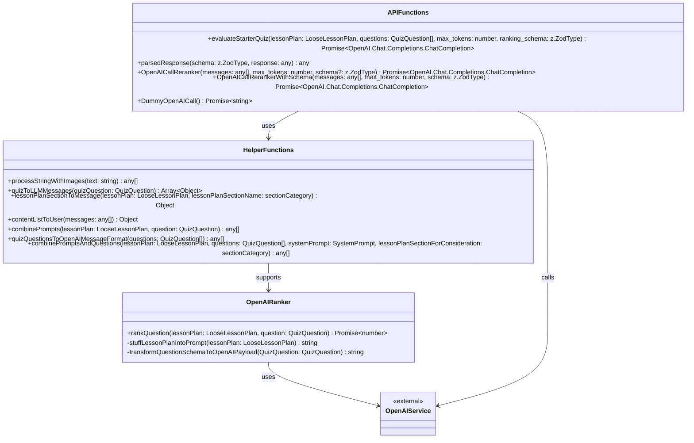

# Diagram

```mermaid
classDiagram
    class OpenAIRanker {
        +rankQuestion(lessonPlan: LooseLessonPlan, question: QuizQuestion) Promise~number~
        -stuffLessonPlanIntoPrompt(lessonPlan: LooseLessonPlan) string
        -transformQuestionSchemaToOpenAIPayload(QuizQuestion: QuizQuestion) string
    }
    class OpenAIService {
        <<external>>
    }
    class HelperFunctions {
        +processStringWithImages(text: string) any[]
        +quizToLLMMessages(quizQuestion: QuizQuestion) Array~Object~
        +lessonPlanSectionToMessage(lessonPlan: LooseLessonPlan, lessonPlanSectionName: sectionCategory) Object
        +contentListToUser(messages: any[]) Object
        +combinePrompts(lessonPlan: LooseLessonPlan, question: QuizQuestion) any[]
        +quizQuestionsToOpenAIMessageFormat(questions: QuizQuestion[]) any[]
        +combinePromptsAndQuestions(lessonPlan: LooseLessonPlan, questions: QuizQuestion[], systemPrompt: SystemPrompt, lessonPlanSectionForConsideration: sectionCategory) any[]
    }
    class APIFunctions {
        +evaluateStarterQuiz(lessonPlan: LooseLessonPlan, questions: QuizQuestion[], max_tokens: number, ranking_schema: z.ZodType) Promise~OpenAI.Chat.Completions.ChatCompletion~
        +parsedResponse(schema: z.ZodType, response: any) any
        +OpenAICallReranker(messages: any[], max_tokens: number, schema?: z.ZodType) Promise~OpenAI.Chat.Completions.ChatCompletion~
        +OpenAICallRerankerWithSchema(messages: any[], max_tokens: number, schema: z.ZodType) Promise~OpenAI.Chat.Completions.ChatCompletion~
        +DummyOpenAICall() Promise~string~
    }
    OpenAIRanker --> OpenAIService : uses
    HelperFunctions --> OpenAIRanker : supports
    APIFunctions --> OpenAIService : calls
    APIFunctions --> HelperFunctions : uses
```
